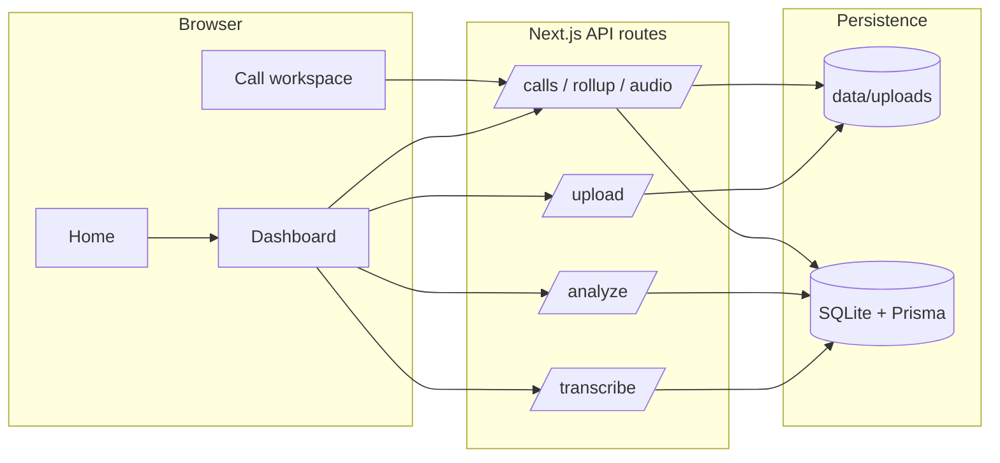

# CallIntel — AI sales call intelligence

Single Next.js application: **upload audio → Whisper transcription → GPT analysis → main dashboard + per-call workspace**. Built for hackathon demos and judge review.

---

## Security

- **Never commit API keys.** Use `.env.local` only (see [Setup](#setup)).
- If a key was ever shared publicly, **revoke it** in the [OpenAI API keys](https://platform.openai.com/api-keys) dashboard and create a new one.

---

## Working prototype (deliverable)

End-to-end flow:

1. **Upload** — `POST /api/upload` stores audio under `data/uploads/`.
2. **Transcribe** — `POST /api/transcribe?call_id=` (Whisper-1, verbose JSON segments).
3. **Analyze** — `POST /api/analyze?call_id=` runs modular GPT prompts; stores insights JSON.
4. **Dashboards** — `/dashboard` (rollup + charts + call list), `/calls/[id]` (audio, transcript, scores, questionnaire, actions).
5. **Compare** — `/compare` selects 2–4 analyzed calls for side-by-side metrics (gratitude, interactivity, order signal, satisfaction, discovery, talk balance, follow-up) plus order/commitment evidence. New analyses store full comparison scores; older rows use derived estimates until re-analyzed.

Optional **demo data** without OpenAI: `npm run db:seed`.

---

## Architecture (high level)



- **Frontend:** App Router pages + client components (Recharts, uploads, delete confirmations).
- **Backend:** Route handlers only (no separate server).
- **AI:** OpenAI Whisper + Chat Completions (`OPENAI_MODEL`, default `gpt-4o-mini`).
- **DB:** Prisma ORM; SQLite file `prisma/dev.db`.

---

## Repository structure

```
call-intel/
├── prisma/
│   ├── schema.prisma      # Call model (transcript + insights JSON strings)
│   ├── seed.ts            # Optional demo calls
│   └── dev.db             # Created after db push (gitignored)
├── docs/
│   └── PROMPTS_LOG.md     # Prompt / Vibe Coding deliverable starter
├── data/uploads/          # Audio files (gitignored, created at runtime)
├── src/
│   ├── app/
│   │   ├── api/           # upload, transcribe, analyze, calls, compare, audio, rollup
│   │   ├── dashboard/     # Main dashboard UI
│   │   ├── calls/[id]/    # Per-call workspace
│   │   ├── globals.css    # Theme, mesh background, grid
│   │   ├── layout.tsx
│   │   └── page.tsx       # Landing + workflow
│   ├── components/        # Nav, checklist, confirm dialog, UI primitives
│   └── lib/
│       ├── analysis.ts    # GPT prompts + orchestration
│       ├── transcribe-whisper.ts
│       ├── questionnaire.ts   # Q1–Q15 topics
│       ├── rollup.ts
│       ├── prisma.ts
│       └── types.ts
├── .env.example
└── README.md
```

---

## Setup (step by step)

```bash
cd call-intel
npm install
npx prisma generate
npx prisma db push
npm run db:seed    # optional
```

Create **`.env.local`** (copy from `.env.example`):

```env
OPENAI_API_KEY=sk-...
OPENAI_MODEL=gpt-4o-mini
```

Run:

```bash
npm run dev
```

Open [http://localhost:3000](http://localhost:3000).

**Prisma:** Keep `prisma` and `@prisma/client` on the **same major version** (see `package.json`). Mixed majors cause missing engine errors on Windows.

---

## API reference

| Method | Path | Purpose |
|--------|------|---------|
| POST | `/api/upload` | Multipart `file` (+ optional `filename`) |
| POST | `/api/transcribe?call_id=` | Whisper → normalized transcript |
| POST | `/api/analyze?call_id=` | GPT analysis → insights |
| GET | `/api/calls` | List calls |
| GET | `/api/calls/[id]` | One call + transcript + insights + `audioUrl` |
| DELETE | `/api/calls/[id]` | Delete DB row **and** audio file on disk |
| GET | `/api/audio/[id]` | Stream audio |
| GET | `/api/rollup` | Aggregated dashboard metrics |
| POST | `/api/auth/login` | JSON `{ email, password }` — sets httpOnly session cookie |
| POST | `/api/auth/logout` | Clears session cookie |
| GET | `/api/auth/me` | `{ user: string | null }` — current session email |

**Demo sign-in (change in `src/lib/auth-config.ts` for other environments):** `suraj@cp.com` / `admin@123`

Set **`AUTH_SECRET`** in `.env.local` for production-like cookie signing (optional in dev; a default is used).

---

## Key features

- Secure login-protected workspace (`/dashboard`, `/calls/[id]`, `/compare`)
- Audio upload + Whisper transcription + GPT analysis pipeline
- Call-level insights: sentiment, talk-time balance, questionnaire coverage, action items
- Compare report across 2–4 calls (gratitude, interactivity, order signal, satisfaction, discovery, follow-up)
- Advanced insights: deal prediction, AI coaching suggestions, objection detection + response

---

## UI routes

| Path | Description |
|------|-------------|
| `/` | Public landing + workflow |
| `/login` | Sign-in (redirects to `/dashboard` when already authenticated) |
| `/dashboard` | Metrics, charts, upload — **requires login** |
| `/calls/[id]` | Call workspace — **requires login** |
| `/compare` | Side-by-side multi-call comparison — **requires login** |

---

## Publish to GitHub

Repository target:

- [imsurajparmar/ai-powered-call-intelligence-platform](https://github.com/imsurajparmar/ai-powered-call-intelligence-platform)

Commands used to publish this project:

```bash
git init
git branch -M main
git add .
git commit -m "Initial commit: AI-powered Call Intelligence Platform"
git remote add origin https://github.com/imsurajparmar/ai-powered-call-intelligence-platform.git
git push -u origin main
```

---

## Notes

- **Speakers:** Whisper does not diarize; segments use **alternating agent/customer** for demo charts. Use a diarized STT provider for production.
- **Large uploads:** If requests fail, reduce file size or increase platform body limits.
- **Analysis time:** Several GPT calls in parallel; allow **1–3 minutes** for long calls.

### Build: `globals.css` SyntaxError at line 24

If you see **`expected ","`** pointing at `globals.css`, it was usually **invalid CSS emitted by Tailwind** from utilities like `bg-[hsl(var(--card))]/40` without the **`hsl(... / <alpha-value>)`** pattern in `tailwind.config.ts`. This project uses **semantic tokens** (`bg-card/40`, `border-border`, `text-muted-foreground`, etc.) and **`hsl(var(--x) / <alpha-value>)`** in the theme so opacity modifiers are valid. After pulling changes, delete **`.next`** and rebuild.

### Windows: Webpack cache warning (`typescript.js` / `D:\` vs `d:\`)

You may see a long warning like *Resolving … typescript … doesn't lead to expected result* with paths that differ only by **drive-letter casing**. That is **normal on Windows** (same folder, different string). The dev server usually still works.

- Delete the build cache: remove the **`.next`** folder, then run `npm run dev` again.
- Prefer opening the project and running commands from one place (e.g. always `D:\wamp\...`) so paths stay consistent.
- `next.config.mjs` lowers **infrastructure** log noise on Windows unless you set **`WEBPACK_VERBOSE=1`**.

---

## License

Add a `LICENSE` file before open-sourcing if required by your hackathon.
